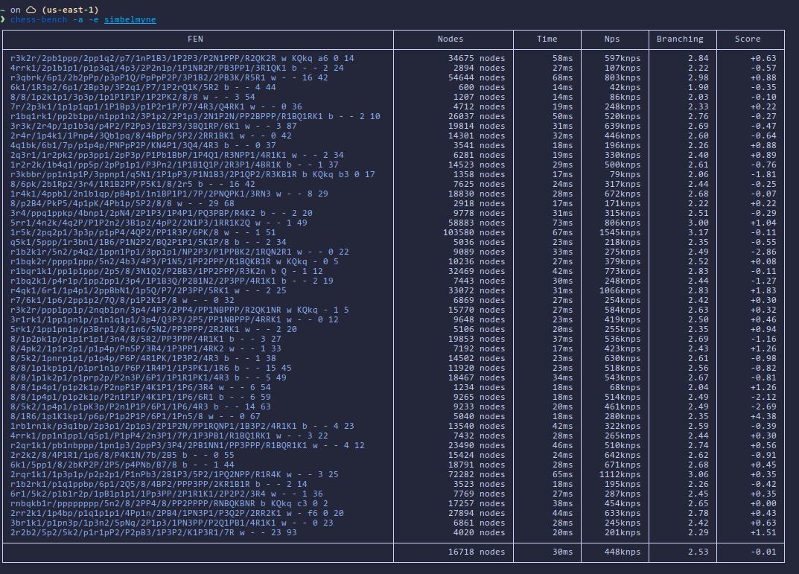
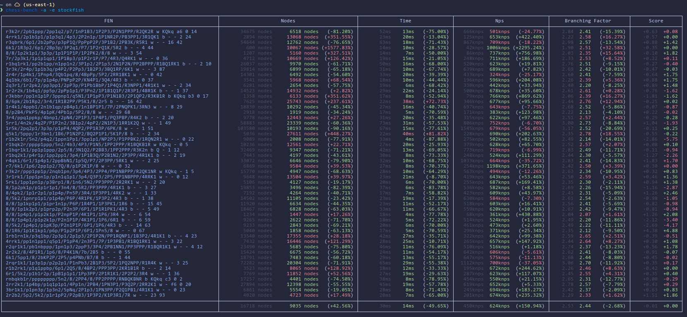

# chess-bench
A tool for easy benchmarking and snapshot testing a UCI chess engine.

Use chess-bench to:
1. Benchmark your engine
2. Diff a benchmark against a stored snapshot (useful for comparing branches or
   different engines)
3. Add CI tests that fail when non-functional changes don't match stored
   snapshots

## Usage
run `cb --help` for a list of options

## Examples
### Running a benchmark
Run chess-bench with the `--all`/`-a` flag to output all the available metrics
in a table. Pass the path to the engine you'd like to benchmark with the `-e` 
flag.

```
$ chess-bench -a -e simbelmyne
```



### Diffing against a snapshot
When running chess-bench, pass the `--save`/`-S` flag to save the results
to `bench_snapshot.json`. The output file can be changed by passing the
`--output`/`-o` flag.

When running `chess-bench` in a directory that has a `bench_snapshot.json` file
present (or when passed a snapshot explicitly using `--snapshot`/`-s`),
the engine outputs a snapshot diff instead.


